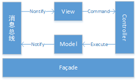
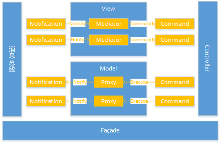

# PureMVC

[PureMVC](https://www.gameres.com/822910.html)

## Pattern

### 单例

[单例模式](https://www.runoob.com/design-pattern/singleton-pattern.html)

### 观察者

[观察者模式](https://www.runoob.com/design-pattern/observer-pattern.html)

### Facade 外观

[外观模式](https://www.runoob.com/design-pattern/facade-pattern.html)

### Proxy 代理

[代理模式](https://www.runoob.com/design-pattern/proxy-pattern.html)

### Mediator 中介者

[中介者模式](https://www.runoob.com/design-pattern/mediator-pattern.html)

### Command 命令

[命令模式](https://www.runoob.com/design-pattern/command-pattern.html)

## Facade

### Model

#### void RegisterProxy(IProxy proxy);

#### IProxy RemoveProxy(string proxyName);

#### IProxy RetrieveProxy(string proxyName);

#### bool HasProxy(string proxyName);

### Proxy

#### void OnRegister();

#### void OnRemove();

### View

#### void RegisterMediator(IMediator mediator);

#### IMediator RemoveMediator(string mediatorName);

#### IMediator RetrieveMediator(string mediatorName);

#### bool HasMediator(string mediatorName);

#### void RegisterObserver(string notificationName, IObserver observer);

#### void RemoveObserver(string notificationName, object notifyContext);

#### void NotifyObservers(INotification note);

### Mediator

#### void OnRegister();

#### void OnRemove();

#### IList<string> ListNotificationInterests();

#### void HandleNotification(INotification notification);

### Controller

#### void RegisterCommand(string notificationName, Type commandType);

#### void RemoveCommand(string notificationName);

#### void ExecuteCommand(INotification notification);

#### bool HasCommand(string notificationName);

### Command

#### void Execute(INotification notification);

## Init Process

### App

#### AppFacade

##### InitializeModel()

###### Facade.InitializeModel()

####### m_model = Model.Instance

######## m_proxyMap = new Dictionary<string, IProxy>()

###### Facade.RegisterProxy()

####### m_model.RegisterProxy(proxy)

######## m_proxyMap[proxy.ProxyName] = proxy

##### InitializeController()

###### Facade.InitializeController()

####### m_controller = Controller.Instance

######## m_commandMap = new Dictionary<string, ICommand>()

######## m_view = View.Instance;

###### Facade.RegisterCommand()

####### m_controller.RegisterCommand(notificationName, commandType)

######## m_view.RegisterObserver(notificationName, new Observer("executeCommand", this));

######## m_commandMap[notificationName] = commandType;

##### InitializeView()

###### Facade.InitializeView()

####### m_view = View.Instance

######## m_mediatorMap = new Dictionary<string, IMediator>();

######## m_observerMap = new Dictionary<string, IList<IObserver>>();

###### Facade.RegiesterMediator()

####### m_view.RegisterMediator(mediator);

######## m_mediatorMap[mediator.MediatorName] = mediator;

######## IObserver observer = new Observer("handleNotification", mediator)

######## m_observerMap[notificationName].Add(observer)

## Notify Process

### View

#### RegisterObserver(string notificationName, IObserver observer)

##### m_observerMap[notificationName].Add(observer)

#### NotifyObservers(INotification notification)

##### observer[i].NotifyObserver(notification);

###### type.GetMethod(methodName,f).Invoke(context,new object[] { notification });
