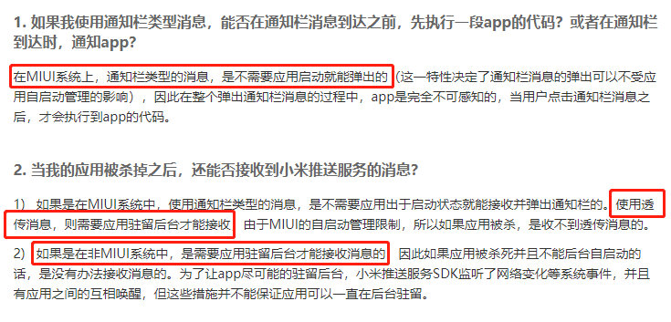
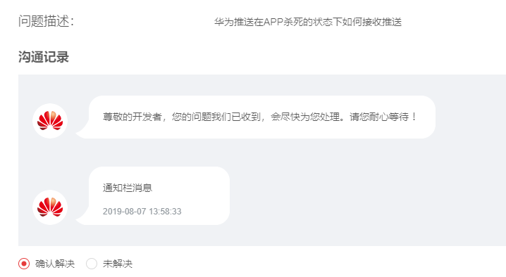

# Android离线应用接收推送方法

<!-- TOC -->

- [Android离线应用接收推送方法](#android离线应用接收推送方法)
    - [通知栏消息离线接收条件](#通知栏消息离线接收条件)
        - [手机厂商自带推送](#手机厂商自带推送)
        - [必须使用通知栏消息](#必须使用通知栏消息)
    - [透传离线接收消息需要用户手动操作](#透传离线接收消息需要用户手动操作)
        - [小米【MIUI】](#小米miui)
        - [华为【Emotion】](#华为emotion)
        - [魅族【Flyme】](#魅族flyme)
        - [VIVO【Funtouch OS】](#vivofuntouch-os)
        - [OPPO【ColorOS】](#oppocoloros)
    - [工单回复](#工单回复)
        - [华为](#华为)

<!-- /TOC -->

## 通知栏消息离线接收条件

### 手机厂商自带推送

### 必须使用通知栏消息

## 透传离线接收消息需要用户手动操作

### 小米【MIUI】

自启动管理：需要把应用加到【自启动管理】列表，否则杀进程或重新开机后进程无法开启
通知栏设置：应用默认都是显示通知栏通知，如果关闭，则收到通知也不会提示
网络助手：可以手动禁止已安装的第三方程序访问2G/3G和WIFI的网络和设置以后新安装程序是否允许访问2G/3G和WIFI的网络
MIUI 7 神隐模式： 允许应用进行自定义配置模式，应用在后台保持联网可用，否则应用进入后台时，应用无法正常接收消息。【设置】下电量和性能中【神隐模式】

### 华为【Emotion】

自启动管理：需要把应用加到【自启动管理】列表，否则杀进程或重新开机后进程不会开启，只能手动开启应用
后台应用保护：需要手动把应用加到此列表，否则设备进入睡眠后会自动杀掉应用进程，只有手动开启应用才能恢复运行
通知管理：应用状态有三种：提示、允许、禁止。禁止应用则通知栏不会有任何提醒

### 魅族【Flyme】

自启动管理：需要把应用加到【自启动管理】列表，否则杀进程或重新开机后进程无法开启
通知栏推送：关闭应用通知则收到消息不会有任何展示
省电管理： 安全中心里设置省电模式，在【待机耗电管理】中允许应用待机时，保持允许，否则手机休眠或者应用闲置一段时间，无法正常接收消息。

### VIVO【Funtouch OS】

内存一键清理：需要将应用加入【白名单】列表，否则系统自带的“一键加速”，会杀掉进程
自启动管理：需要将应用加入“i管家”中的【自启动管理】列表，否则重启手机后进程不会自启。但强制手动杀进程，即使加了这个列表中，后续进程也无法自启动。

### OPPO【ColorOS】

冻结应用管理：需要将应用加入纯净后台，否则锁屏状态下无法及时收到消息
自启动管理：将应用加入【自启动管理】列表的同时，还需要到设置-应用程序-正在运行里锁定应用进程，否则杀进程或者开机后进程不会开启，只能手动开启应用

## 工单回复

### 华为
