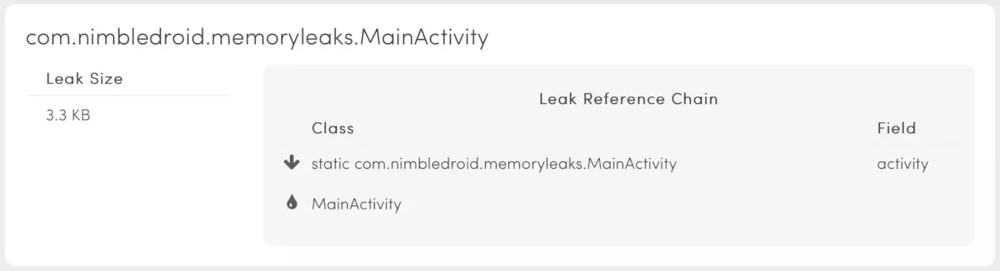
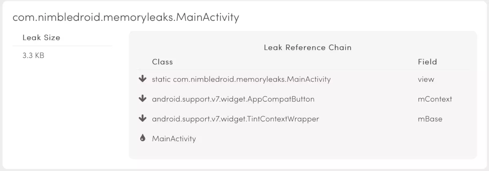
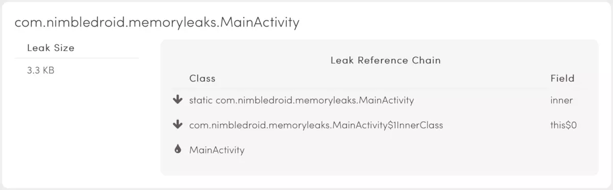
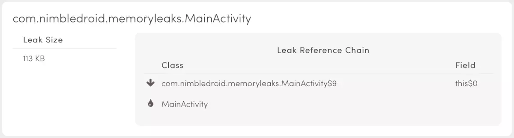
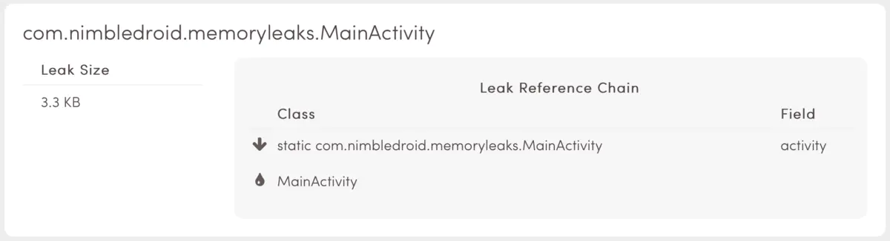
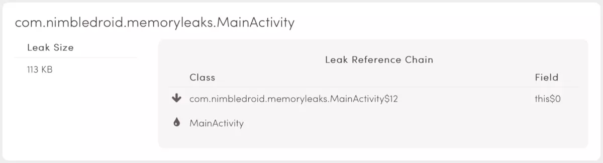
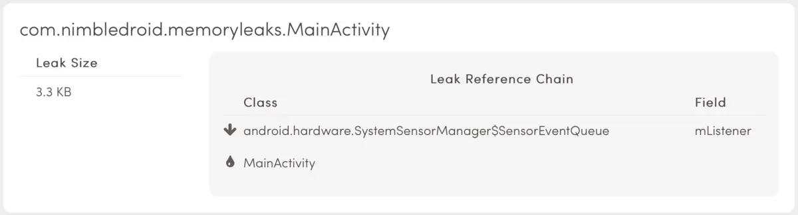

# Android 开发常见内存泄漏问题和对应的解决方法

<!-- TOC -->

- [Android 开发常见内存泄漏问题和对应的解决方法](#android-开发常见内存泄漏问题和对应的解决方法)
    - [内存泄漏的原因](#内存泄漏的原因)
    - [常见内存泄漏问题](#常见内存泄漏问题)
        - [1.Static Activity](#1static-activity)
            - [原因](#原因)
            - [解决方法](#解决方法)
        - [2.Static Views](#2static-views)
            - [原因](#原因-1)
            - [解决方法](#解决方法-1)
        - [3.Inner Classes](#3inner-classes)
            - [原因](#原因-2)
            - [解决方法](#解决方法-2)
        - [4.Anonymous Classes](#4anonymous-classes)
            - [原因](#原因-3)
            - [解决方法](#解决方法-3)
        - [5.Handler](#5handler)
            - [原因](#原因-4)
            - [解决方法](#解决方法-4)
        - [6.Threads](#6threads)
            - [原因](#原因-5)
            - [解决方法](#解决方法-5)
        - [7.TimerTask](#7timertask)
            - [原因](#原因-6)
            - [解决方法](#解决方法-6)
        - [8.Sensor Manager](#8sensor-manager)
            - [原因](#原因-7)
            - [解决方法](#解决方法-7)

<!-- /TOC -->

## 内存泄漏的原因

一般内存泄漏(traditional memory leak)的原因是：由忘记释放分配的内存导致的。（Cursor 忘记关闭等）
逻辑内存泄漏(logical memory leak)的原因是：当应用不再需要这个对象，当仍未释放该对象的所有引用。

**如果持有对象的强引用，垃圾回收器是无法在内存中回收这个对象。**

在 Android 开发中，最容易引发的内存泄漏问题的是 Context。比如 Activity 的 Context，就包含大量的内存引用，例如 View Hierarchies 和其他资源。一旦泄漏了 Context，也意味泄漏它指向的所有对象。Android 机器内存有限，太多的内存泄漏容易导致 OOM。

Activity 有着明确的生命周期，很容易发现泄漏的原因。Activity.onDestroy()被视为 Activity 生命的结束，程序上来看，它应该被销毁了，或者 Android 系统需要回收这些内存（当内存不够时，Android 会回收看不见的 Activity）。
如果这个方法执行完，在堆栈中仍存在持有该 Activity 的强引用，垃圾回收器就无法把它标记成已回收的内存，而我们本来目的就是要回收它！
结果就是 Activity 存活在它的生命周期之外。

Activity 是重量级对象，应该让 Android 系统来处理它。然而，逻辑内存泄漏总是在不经意间发生。（曾经试过一个 Activity 导致 20M 内存泄漏）。在 Android 中，导致潜在内存泄漏的陷阱不外乎两种：

- 全局进程(process-global)的 static 变量。这个无视应用的状态，持有 Activity 的强引用的怪物。

- 活在 Activity 生命周期之外的线程。没有清空对 Activity 的强引用。

## 常见内存泄漏问题

### 1.Static Activity

#### 原因

在类中定义了静态 Activity 变量，把当前运行的 Activity 实例赋值于这个静态变量。
如果这个静态变量在 Activity 生命周期结束后没有清空，就导致内存泄漏。因为 static 变量是贯穿这个应用的生命周期的，所以被泄漏的 Activity 就会一直存在于应用的进程中，不会被垃圾回收器回收。

```java
    static Activity activity;

    void setStaticActivity() {
      activity = this;
    }

    View saButton = findViewById(R.id.sa_button);
    saButton.setOnClickListener(new View.OnClickListener() {
      @Override public void onClick(View v) {
        setStaticActivity();
        nextActivity();
      }
    });
```



#### 解决方法

构造静态变量持有 Activity 对象很容易造成内存泄漏，因为静态变量是全局存在的，所以当 MainActivity 生命周期结束时，引用仍被持有。这种写法开发者是有理由来使用的，所以我们需要正确的释放引用让垃圾回收机制在它被销毁的同时将其回收。

Android 提供了特殊的 Set 集合

https://developer.android.com/reference/java/lang/ref/package-summary.html#classes

允许开发者控制引用的“强度”。Activity 对象泄漏是由于需要被销毁时，仍然被强引用着，只要强引用存在就无法被回收。

可以用弱引用代替强引用。

https://developer.android.com/reference/java/lang/ref/WeakReference.html.

弱引用不会阻止对象的内存释放，所以即使有弱引用的存在，该对象也可以被回收。

```java
    private static WeakReference<MainActivity> activityReference;

    void setStaticActivity() {
        activityReference = new WeakReference<MainActivity>(this);
    }
```

### 2.Static Views

#### 原因

类似的情况会发生在单例模式中，如果 Activity 经常被用到，那么在内存中保存一个实例是很实用的。正如之前所述，强制延长 Activity 的生命周期是相当危险而且不必要的，无论如何都不能这样做。

特殊情况：如果一个 View 初始化耗费大量资源，而且在一个 Activity 生命周期内保持不变，那可以把它变成 static，加载到视图树上(View Hierachy)，像这样，当 Activity 被销毁时，应当释放资源。（译者注：示例代码中并没有释放内存，把这个 static view 置 null 即可，但是还是不建议用这个 static view 的方法）

```java
    static view;

    void setStaticView() {
      view = findViewById(R.id.sv_button);
    }

    View svButton = findViewById(R.id.sv_button);
    svButton.setOnClickListener(new View.OnClickListener() {
      @Override public void onClick(View v) {
        setStaticView();
        nextActivity();
      }
    });
```



#### 解决方法

由于 View 持有其宿主 Activity 的引用，导致的问题与 Activity 一样严重。弱引用是个有效的解决方法，然而还有另一种方法是在生命周期结束时清除引用，Activity#onDestory()方法就很适合把引用置空。

```java
    private static View view;

    @Override
    public void onDestroy() {
        super.onDestroy();
        if (view != null) {
            unsetStaticView();
        }
    }

    void unsetStaticView() {
        view = null;
    }
```

### 3.Inner Classes

#### 原因

继续，假设 Activity 中有个内部类，这样做可以提高可读性和封装性。将如我们创建一个内部类，而且持有一个静态变量的引用，恭喜，内存泄漏就离你不远了（销毁的时候置空，嗯）。
内部类的优势之一就是可以访问外部类，不幸的是，导致内存泄漏的原因，就是内部类持有外部类实例的强引用。

```java
    private static Object inner;

    void createInnerClass() {
        class InnerClass {
        }
        inner = new InnerClass();
    }

    View icButton = findViewById(R.id.ic_button);
    icButton.setOnClickListener(new View.OnClickListener() {
        @Override public void onClick(View v) {
            createInnerClass();
            nextActivity();
        }
    });
```



#### 解决方法

与上述两种情况相似，开发者必须注意少用非静态内部类，因为非静态内部类持有外部类的隐式引用，容易导致意料之外的泄漏。然而内部类可以访问外部类的私有变量，只要我们注意引用的生命周期，就可以避免意外的发生。

> 避免静态变量

这样持有内部类的成员变量是可以的。

```java
    private Object inner;

    void createInnerClass() {
        class InnerClass {
        }
        inner = new InnerClass();
    }
```

### 4.Anonymous Classes

#### 原因

相似地，匿名类也维护了外部类的引用。所以内存泄漏很容易发生，当你在 Activity 中定义了匿名的 AsyncTsk
。当异步任务在后台执行耗时任务期间，Activity 不幸被销毁了（译者注：用户退出，系统回收），这个被 AsyncTask 持有的 Activity 实例就不会被垃圾回收器回收，直到异步任务结束。

```java
    void startAsyncTask() {
        new AsyncTask<Void, Void, Void>() {
            @Override protected Void doInBackground(Void... params) {
                while(true);
            }
        }.execute();
    }

    super.onCreate(savedInstanceState);
    setContentView(R.layout.activity_main);
    View aicButton = findViewById(R.id.at_button);
    aicButton.setOnClickListener(new View.OnClickListener() {
        @Override public void onClick(View v) {
            startAsyncTask();
            nextActivity();
        }
    }); java

```



#### 解决方法

正如使用内部类一样，只要不跨越生命周期，内部类是完全没问题的。但是，这些类是用于产生后台线程的，这些 Java 线程是全局的，而且持有创建者的引用（即匿名类的引用），而匿名类又持有外部类的引用。线程是可能长时间运行的，所以一直持有 Activity 的引用导致当销毁时无法回收。
这次我们不能通过移除静态成员变量解决，因为线程是于应用生命周期相关的。为了避免泄漏，我们必须舍弃简洁偷懒的写法，把子类声明为静态内部类。

> 静态内部类不持有外部类的引用，打破了链式引用。

```java
    private static class NimbleTask extends AsyncTask<Void, Void, Void> {
        @Override protected Void doInBackground(Void... params) {
            while(true);
        }
    }

    void startAsyncTask() {
        new NimbleTask().execute();
    }
```

### 5.Handler

#### 原因

同样道理，定义匿名的 Runnable，用匿名类 Handler 执行。Runnable 内部类会持有外部类的隐式引用，被传递到 Handler 的消息队列 MessageQueue 中，在 Message 消息没有被处理之前，Activity 实例不会被销毁了，于是导致内存泄漏。

```java
    void createHandler() {
        new Handler() {
            @Override public void handleMessage(Message message) {
                super.handleMessage(message);
            }
        }.postDelayed(new Runnable() {
            @Override public void run() {
                while(true);
            }
        }, Long.MAX_VALUE >> 1);
    }


    View hButton = findViewById(R.id.h_button);
    hButton.setOnClickListener(new View.OnClickListener() {
        @Override public void onClick(View v) {
            createHandler();
            nextActivity();
        }
    });
```



#### 解决方法

也是 Anonymous Classes 导致的,同上

```java
    private static class NimbleHandler extends Handler {
        @Override public void handleMessage(Message message) {
            super.handleMessage(message);
        }
    }

    private static class NimbleRunnable implements Runnable {
        @Override public void run() {
            while(true);
        }
    }

    void createHandler() {
        new NimbleHandler().postDelayed(new NimbleRunnable(), Long.MAX_VALUE >> 1);
    }
```

### 6.Threads

#### 原因

我们通过 Thread 来展现内存泄漏。

```java
    void spawnThread() {
        new Thread() {
            @Override public void run() {
                while(true);
            }
        }.start();
    }

    View tButton = findViewById(R.id.t_button);
    tButton.setOnClickListener(new View.OnClickListener() {
      @Override public void onClick(View v) {
          spawnThread();
          nextActivity();
      }
    });
```



#### 解决方法

如果你坚持使用匿名类，只要在生命周期结束时中断线程就可以。

```java
    private Thread thread;

    @Override
    public void onDestroy() {
        super.onDestroy();
        if (thread != null) {
            thread.interrupt();
        }
    }

    void spawnThread() {
        thread = new Thread() {
            @Override public void run() {
                while (!isInterrupted()) {
                }
            }
        }
        thread.start();
    }
```

### 7.TimerTask

#### 原因

只要是匿名类的实例，不管是不是在工作线程，都会持有 Activity 的引用，导致内存泄漏。

```java
    void scheduleTimer() {
        new Timer().schedule(new TimerTask() {
            @Override
            public void run() {
                while(true);
            }
        }, Long.MAX_VALUE >> 1);
    }

    View ttButton = findViewById(R.id.tt_button);
    ttButton.setOnClickListener(new View.OnClickListener() {
        @Override public void onClick(View v) {
            scheduleTimer();
            nextActivity();
        }
    });
```


#### 解决方法

同匿名类

```java
    private static class NimbleTimerTask extends TimerTask {
        @Override public void run() {
            while(true);
        }
    }

    void scheduleTimer() {
        new Timer().schedule(new NimbleTimerTask(), Long.MAX_VALUE >> 1);
    }
```

### 8.Sensor Manager

#### 原因

最后，通过 Context.getSystemService(int name)可以获取系统服务。这些服务工作在各自的进程中，帮助应用处理后台任务，处理硬件交互。如果需要使用这些服务，可以注册监听器，这会导致服务持有了 Context 的引用，如果在 Activity 销毁的时候没有注销这些监听器，会导致内存泄漏。

```java
    void registerListener() {
            SensorManager sensorManager = (SensorManager) getSystemService(SENSOR_SERVICE);
            Sensor sensor = sensorManager.getDefaultSensor(Sensor.TYPE_ALL);
            sensorManager.registerListener(this, sensor, SensorManager.SENSOR_DELAY_FASTEST);
    }

    View smButton = findViewById(R.id.sm_button);
    smButton.setOnClickListener(new View.OnClickListener() {
        @Override public void onClick(View v) {
            registerListener();
            nextActivity();
        }
    });
```



#### 解决方法

在 Activity 结束时注销监听器

```java
    private SensorManager sensorManager;
    private Sensor sensor;

    @Override
    public void onDestroy() {
        super.onDestroy();
        if (sensor != null) {
            unregisterListener();
        }
    }

    void unregisterListener() {
        sensorManager.unregisterListener(this, sensor);
    }
```
