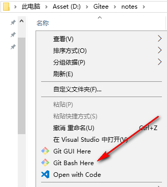
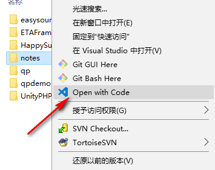
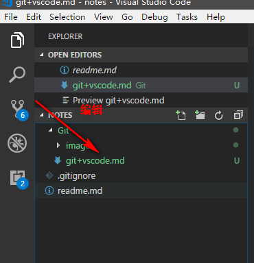
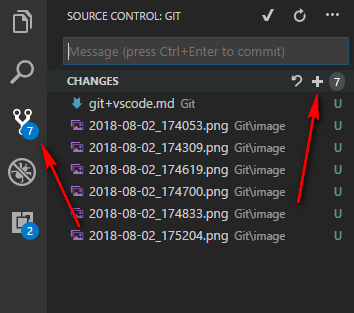
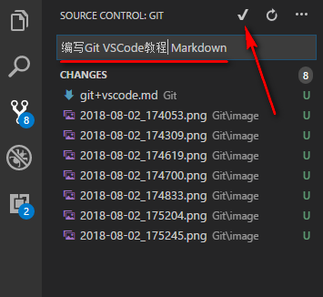
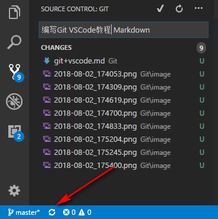

# VSCode 下 Git 的使用

## 下载 git

[下载地址](https://link.jianshu.com/?t=https://git-scm.com/download/win)

## 设置全局配置

```sh
git config --global user.name "your name"
git config --global user.email "your email"  //注意这里的email要和git服务器账户的email保持一致
```

## 新建项目


## 克隆项目





## 编辑项目





## 提交项目







## 国内还是码云好用些


