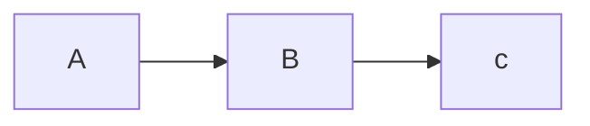
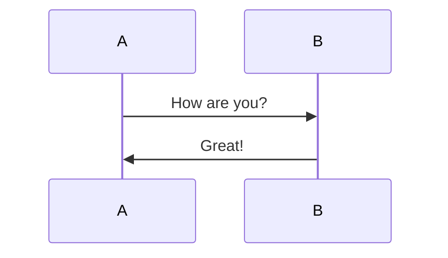
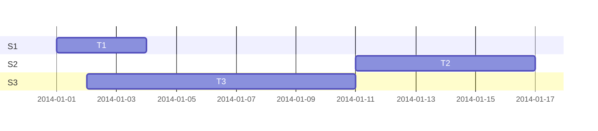

# 双链测试

[test_note1](../88126fb48eff3a2801350be86a88d44654485719)

[[9.输出\hexo\test_note2]]

[[9.输出\hexo\deep\test_note2]]

# Markdown 示例

Markdown简易入门教程   
使用方式：打开 Source Mode 就可以看到所有markdown格式，照着来用就行了    
  
  
## 标题

```
# 标题一  
  
## 标题二  

  
### 标题三  

  
#### 标题四  

  
##### 标题五  

  
###### 标题六

```
  
  
## 文本

**粗体**   

> 引用   

~~中划线~~   

<u>下划线</u> 

---

<mark style="background: #fefe00A6;">三空格+换行＝换行</mark>   

*斜体*   

***斜体加粗体***   

**常用markdown标记?**
  
```sh

**粗体**   

> 引用   

~~中划线~~   

<u>下划线</u> 

---

三空格+换行＝换行   

*斜体*   

***斜体加粗体***   

```
<!--SR:!2022-11-16,64,250-->
  
  
## 段落

  
  
### 链接

[链接](https://gitee.com/qiaogaojian)  
[ide-eval-resetter.zip](/download/ide-eval-resetter.zip)

```
[链接](链接地址)  
[[obsidian双链]]
```
  
  
### 图片


```

![[obsidian 图片]]

```
  
  
### 代码

```java
public class HelloWord{
	public static void main(String[] args){
		System.out.println("HelloWord");
	}
}
```

```json
{  
  "sites": {  
    "site": [  
      {  
        "id": "1",  
        "name": "github",  
        "url": "https://github.com/"  
      },  
      {  
        "id": "2",  
        "name": "google",  
        "url": "http://google.com/"  
      },  
      {  
        "id": "3",  
        "name": "stackoverflow",  
        "url": "https://stackoverflow.com/"  
      }  
    ]  
  }  
}  
{"sites":{"site":[{"id":"1","name":"github","url":"https://github.com/"},{"id":"2","name":"google","url":"http://google.com/"},{"id":"3","name":"stackoverflow","url":"https://stackoverflow.com/"}]}}  
```
  
  
### 表格

| 标题1     | 标题2     |
| --------- | --------- |
| 行 1 列 1 | 行 1 列 2 |
| 行 2 列 1 | 行 2 列 2 |

**markdown 表格标记**   
  
```
| 标题1     | 标题2     |
| --------- | --------- |
| 行 1 列 1 | 行 1 列 2 |
| 行 2 列 1 | 行 2 列 2 |
```
<!--SR:!2022-08-19,10,250-->
  
  
### 公式

**数学公式**   
```latex
$y = x^2$
```
$y=x^2$

> 注: Latex语法参考[常用 LaTeX 公式符号](../b53e358a25ba3e25467609d60291ee2c9907edf2)

  
  
## 列表

  
  
### 无序

- 普通序列
	- 1
		- a
		- b
		- c
	- 2
	- 3
- 普通序列
- 普通序列
- 普通序列   
  
  
### 有序

1. 数字序列
2. 数字序列
3. 数字序列
4. 数字序列
  
  
### 混合

- 混合序列
  - 混合序列
  - 混合序列
  - 混合序列
  - 混合序列
- 混合序列
- 混合序列
  1. 混合序列
  2. 混合序列
  3. 混合序列
  4. 混合序列
- 混合序列
  
  
### 任务

**任务列表**   
  
- [ ] 未完成   
- [x] 已完成   
```
- [ ] 未完成   
- [x] 已完成   
```
<!--SR:!2022-08-16,7,250-->
  
  
## 图表

**mermaid 流程图**   
  
```
graph LR
A-->B
B-->c
```

<!--SR:!2022-11-07,57,250-->

**mermaid 时序图**   
  
```
sequenceDiagram
A->>B: How are you?
B->>A: Great!
```

<!--SR:!2022-11-15,64,250-->

**mermaid 甘特图**   
  
```
gantt
dateFormat YYYY-MM-DD

section S1
T1: 2014-01-01, 3d

section S2
T2: 2014-01-11, 6d

section S3
T3: 2014-01-02, 9d
```

<!--SR:!2022-10-11,40,250-->
  
  
## 注脚

  
```md
Here is a simple footnote[^1].

[^1]: My reference.
```
  
Here is a simple footnote[^1].
  
A footnote can also have multiple lines[^2].  
  
You can also use words, to fit your writing style more closely[^note].
  
[^1]: My reference.
[^2]: Every new line should be prefixed with 2 spaces.  
  This allows you to have a footnote with multiple lines.
[^note]:
    Named footnotes will still render with numbers instead of the text but allow easier identification and linking.  
    This footnote also has been made with a different syntax using 4 spaces for new lines.

**相关笔记:**

- [test_note1](../88126fb48eff3a2801350be86a88d44654485719)
- [test_note2](../2ecb1b3db0ee1e06c985b053a234f661d8ad4410)
- [test_note2](../67a4849e0e109ca44843a368388ff861956e472d)


- 🔵
  - [test_note1](../88126fb48eff3a2801350be86a88d44654485719)
  - [常用 LaTeX 公式符号](../b53e358a25ba3e25467609d60291ee2c9907edf2)
  - [test_note2](../67a4849e0e109ca44843a368388ff861956e472d)
  - [test_note2](../2ecb1b3db0ee1e06c985b053a234f661d8ad4410)
