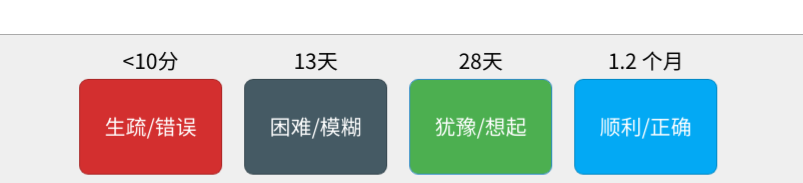

# Anki必装插件

## Enhance main window

增强主页面！可以让你对每天的学习更加清晰！

链接: [Enhance main window](https://ankiweb.net/shared/info/877182321)

配置

```json
{
    "book symbol": "{",
    "cap value": null,
    "color empty": "red",
    "color empty descendant": "green",
    "color marked": true,
    "color zero": false,
    "columns": [
        {
            "absolute": true,
            "color": "red",
            "description": "Number of review you will see today (new, review and learning)",
            "header": null,
            "name": "today",
            "overlay": null,
            "percent": false,
            "present": false,
            "subdeck": true
        },
        {
            "absolute": true,
            "color": "green",
            "description": "Review cards cards you will see today (and the ones you will not see today)",
            "header": null,
            "name": "review",
            "overlay": null,
            "percent": false,
            "present": true,
            "subdeck": true
        },
        {
            "absolute": true,
            "color": "orange",
            "description": "Cards in learning (either new cards you see again, or cards which you have forgotten recently. Assuming those cards didn't graduate)",
            "header": null,
            "name": "learning card",
            "overlay": null,
            "percent": false,
            "present": false,
            "subdeck": true
        },
        {
            "absolute": true,
            "color": "orange",
            "description": "Review which will happen later. Either because a review happened recently, or because the card have many review left.",
            "header": null,
            "name": "learning later",
            "overlay": null,
            "percent": false,
            "present": false,
            "subdeck": true
        },
        {
            "absolute": true,
            "color": "orange",
            "description": "Cards in learning which are due now. If there are no such cards, the time in minutes or seconds until another learning card is due",
            "header": null,
            "name": "learning now",
            "overlay": null,
            "percent": false,
            "present": false,
            "subdeck": true
        },
        {
            "absolute": true,
            "color": "orange",
            "description": "Cards in learning which are due now (and in parenthesis, the number of reviews which are due later)",
            "header": null,
            "name": "learning all",
            "overlay": null,
            "percent": false,
            "present": true,
            "subdeck": true
        },
        {
            "absolute": true,
            "color": "green",
            "description": "Review cards which are due today (not counting the one in learning)",
            "header": null,
            "name": "review due",
            "overlay": null,
            "percent": false,
            "present": false,
            "subdeck": true
        },
        {
            "absolute": true,
            "color": "green",
            "description": "Review cards you will see today",
            "header": null,
            "name": "review today",
            "overlay": null,
            "percent": false,
            "present": false,
            "subdeck": true
        },
        {
            "absolute": true,
            "color": "blue",
            "description": "Cards that have never been answered",
            "header": null,
            "name": "unseen",
            "overlay": null,
            "percent": false,
            "present": false,
            "subdeck": true
        },
        {
            "absolute": true,
            "color": "blue",
            "description": "Unseen+ cards+ you will see today (what anki calls +new cards",
            "header": null,
            "name": "new",
            "overlay": null,
            "percent": false,
            "present": false,
            "subdeck": true
        },
        {
            "absolute": true,
            "color": "blue",
            "description": "Unseen cards you will see today (and those you will not see today)",
            "header": null,
            "name": "unseen new",
            "overlay": null,
            "percent": false,
            "present": true,
            "subdeck": true
        },
        {
            "absolute": true,
            "color": "grey",
            "description": "number of buried cards, (cards you decided not to see today)",
            "header": null,
            "name": "buried",
            "overlay": null,
            "percent": false,
            "present": false,
            "subdeck": true
        },
        {
            "absolute": true,
            "color": "brown",
            "description": "number of suspended cards, (cards you will never see unless you unsuspend them in the browser)",
            "header": null,
            "name": "suspended",
            "overlay": null,
            "percent": false,
            "present": false,
            "subdeck": true
        },
        {
            "absolute": true,
            "color": "black",
            "description": "Number of cards in the deck",
            "header": null,
            "name": "cards",
            "overlay": null,
            "percent": false,
            "present": false,
            "subdeck": true
        },
        {
            "absolute": true,
            "color": "black",
            "description": "Number of cards/note in the deck",
            "header": null,
            "name": "notes/cards",
            "overlay": null,
            "percent": false,
            "present": true,
            "subdeck": true
        },
        {
            "absolute": true,
            "color": "black",
            "description": "Number of cards/note in the deck",
            "header": null,
            "name": "notes",
            "overlay": null,
            "percent": false,
            "present": false,
            "subdeck": true
        },
        {
            "absolute": true,
            "color": "purple",
            "description": "Number of cards reviewed, not yet due",
            "header": null,
            "name": "undue",
            "overlay": null,
            "percent": false,
            "present": false,
            "subdeck": true
        },
        {
            "absolute": true,
            "color": "",
            "description": "Number of cards reviewed, with interval at least 3 weeks",
            "header": null,
            "name": "mature",
            "overlay": null,
            "percent": false,
            "present": false,
            "subdeck": true
        },
        {
            "absolute": true,
            "color": "pink",
            "description": " Number of cards reviewed, with interval less than 3 weeks,",
            "header": null,
            "name": "young",
            "overlay": null,
            "percent": false,
            "present": false,
            "subdeck": true
        },
        {
            "absolute": true,
            "color": "purple",
            "description": "Number of marked note",
            "header": null,
            "name": "marked",
            "percent": false,
            "present": true,
            "subdeck": true
        }
    ],
    "default column color": "grey",
    "do color empty": true,
    "do color marked": true,
    "dot in numbers": true,
    "end symbol": ";",
    "ended marked background color": "yellow",
    "given up symbol": "/",
    "hide values of parent decks": false,
    "hide values of parent decks when subdecks are shown": false,
    "marked backgroud color": "powderblue",
    "marked background color": "powderblue",
    "option": true,
    "pause symbol": "=",
    "refresh rate": 30
}
```

## Speed Focus Mode auto-alert auto-reveal auto-fail

计时提醒，当你在一张卡片上停留时间超过你设置第一个的值，就会发出提醒声音，超过第二个值则会显示答案，超过第三个值则会自动帮你选 again 。

链接: [Speed Focus Mode (auto-alert, auto-reveal, auto-fail)](https://ankiweb.net/shared/info/1046608507)

## Image Occlusion Enhance Alpha for Anki 2.1

这个软件可以让用户在 Anki 中制作遮挡卡片

链接: [Image Occlusion Enhanced Alpha for Anki 2.1](https://ankiweb.net/shared/info/1374772155)

## Review Heatmap

这个软件可以让用户在 Anki 中直观感受自己的学习记录，效果图如下

链接: [Review Heatmap - AnkiWeb](https://ankiweb.net/shared/info/1771074083)

[Review Heatmap - github](https://github.com/glutanimate/review-heatmap/releases)

## Large and Colorful Buttons

把你的 Anki 按键变成这样的：



链接: [Large and Colorful Buttons](https://ankiweb.net/shared/info/1829090218)

码：1829090218

## AnkiConnect

提供了方便制卡的接口，我拿来配合 Chrome 插件用。

链接: [AnkiConnect](https://ankiweb.net/shared/info/2055492159)

码：2055492159

## Anki Zoom / Zooming / Zoom

效果拔群，能更改 Anki 页面大小，Ctrl + 滚轮或者 Ctrt + +/- 都可以。

链接: [Anki Zoom](https://ankiweb.net/shared/info/538879081)

码：538879081

## Anki HRPG

这是Anki与Habitica这两款软件之间的合作交流.把刷卡片这样的行为当做游戏一样,结合及时反馈的原理,刷几张卡片得到经验与金币,通过不断刷卡片激励你不断升级换取更多的游戏元素(等级,装备,背景,装扮,组队打怪,荣耀...).

要了解这个插件,你需要先了解Habitica并且对它使用过一段时间.

链接: [Anki HRPG](https://ankiweb.net/shared/info/954979168)
[Habitica官方网](https://habitica.com/static/front)

## AwesomeTTS

## Power Format Pack: Markdown, code blocks, lists, tables, syntax highlight & more

## True Retention

## Quick note and deck buttons

## Quick Tagging/Tag Toggler

​	标签的插件有很多，这两个也不错。后者受到前者的启发进行改良，可谓威力加强版。

## Edit Field During Review


