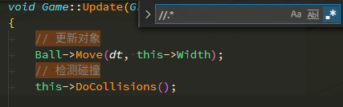
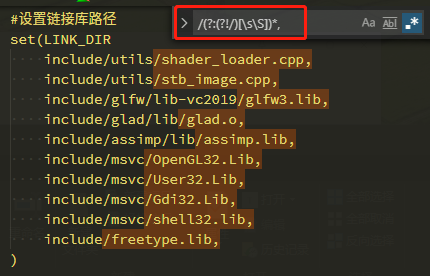
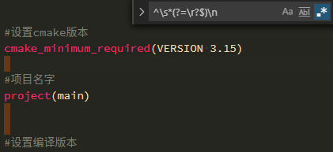

# VSCode正则表达式记录

## 正则表达式学习

## VSCode 正则使用记录

- 匹配反编译后的注释

  ```sh
  # 第一代
  //.*
  # 第二代
  // Token: .*
  ```

  

- 首尾过滤 + 排除

  ```sh
  /(?:(?!/)[\s\S])*,
  ```

  

- 空白行

  ```sh
  ^\s*(?=\r?$)\n
  ```

  

- 删除字幕中的无效数字

    ```
    [1-9][0-9]{0,}


    ```
    替换为
    ```


    ```

- 匹配不包含某字符串(cocos2d)

    ```
    ^((?!cocos2d).)*$
    ```