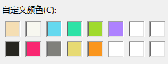
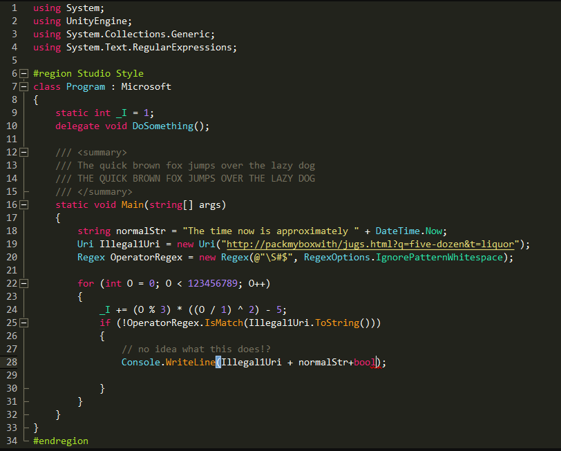

# VS主题颜色配置

## Plugin

Enhanced-Syntax-Highlighting

## Color Code

-----
|1|2|3|4|5|6|
|-|-|-|-|-|-|
|#F5DEB3|#F7F7F0|#65D9EF|#2DE2A6|#A0DA2D|#AE81FF|
|245,222,179|247,247,240|101,217,239|45,226,166|160,218,45|174,129,255|

-----
|7|8|9|10|11||
|-|-|-|-|-|-|
|#262620|#F92671|#80807B|#E7DA73|#FA961E||
|38,39,33|249,38,113|128,128,123|231,218,115|250,150,30||

## Demo

## Download

[点击下载](/download/visual_studio.vssettings)