# 7.31至8.7工作总结

<!-- TOC -->

- [7.31至8.7工作总结](#731至87工作总结)
    - [7.31](#731)
        - [商城3级tab记录](#商城3级tab记录)
        - [商城唯一道具显示永久](#商城唯一道具显示永久)
        - [游戏内记事本防连点间隔调整](#游戏内记事本防连点间隔调整)
    - [8.3](#83)
        - [商城新物品提示](#商城新物品提示)
            - [新加获取背包提示状态请求和点击新物品提示请求](#新加获取背包提示状态请求和点击新物品提示请求)
            - [在点击新物品提示请求的回调里刷新红点](#在点击新物品提示请求的回调里刷新红点)
            - [刷新红点的实现](#刷新红点的实现)
    - [8.5](#85)
        - [商城新增【全部】tab](#商城新增全部tab)
        - [商城背包切换](#商城背包切换)
        - [开屏广告屏蔽](#开屏广告屏蔽)
    - [8.6～8.7](#8687)
        - [上架物品清单热销状态](#上架物品清单热销状态)
        - [本地化文案优化调整，替换最新运营修改返回的文案翻译和图片](#本地化文案优化调整替换最新运营修改返回的文案翻译和图片)
    - [Bug修复及优化](#bug修复及优化)
        - [优化Git提交流程](#优化git提交流程)
            - [gradle脚本](#gradle脚本)
            - [githook bash脚本](#githook-bash脚本)
        - [重构背包商城代码, 修改一级分类为数据驱动,提高代码兼容性](#重构背包商城代码-修改一级分类为数据驱动提高代码兼容性)
            - [1.新建一级分类适配器,用列表来管理](#1新建一级分类适配器用列表来管理)
            - [2.整合背包和商城分类的数据结构](#2整合背包和商城分类的数据结构)
            - [3.删除重构后的无用代码](#3删除重构后的无用代码)

<!-- /TOC -->

## 7.31

### 商城3级tab记录

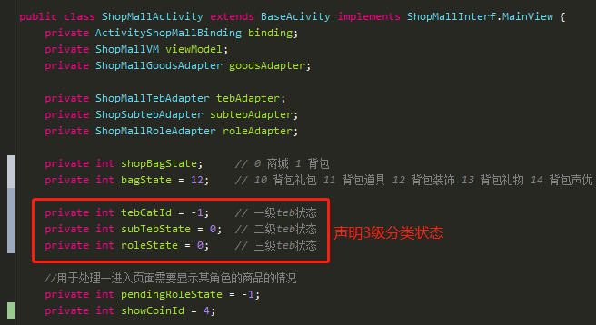

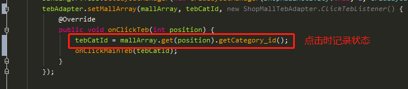

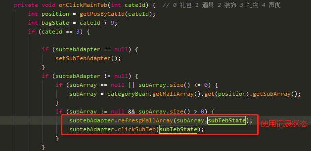

### 商城唯一道具显示永久

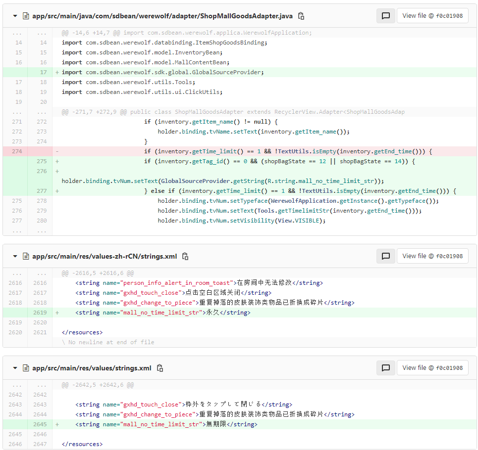

### 游戏内记事本防连点间隔调整

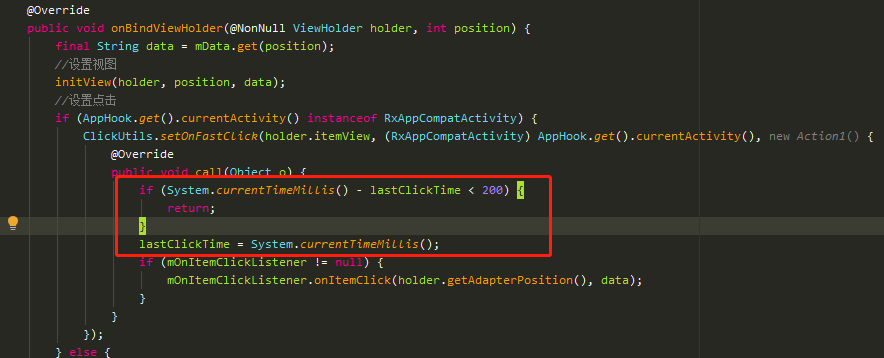

## 8.3

### 商城新物品提示

#### 新加获取背包提示状态请求和点击新物品提示请求

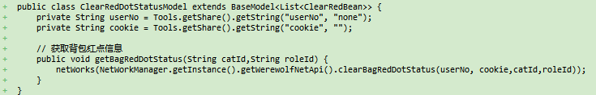

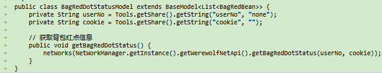

#### 在点击新物品提示请求的回调里刷新红点

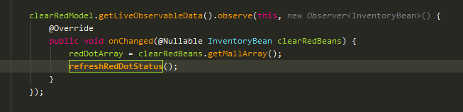

#### 刷新红点的实现

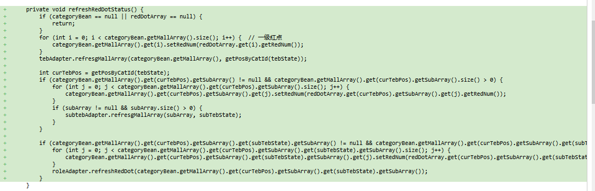

## 8.5

### 商城新增【全部】tab

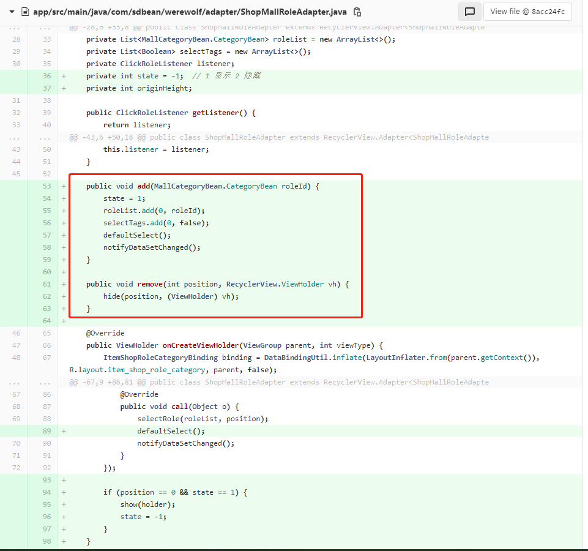

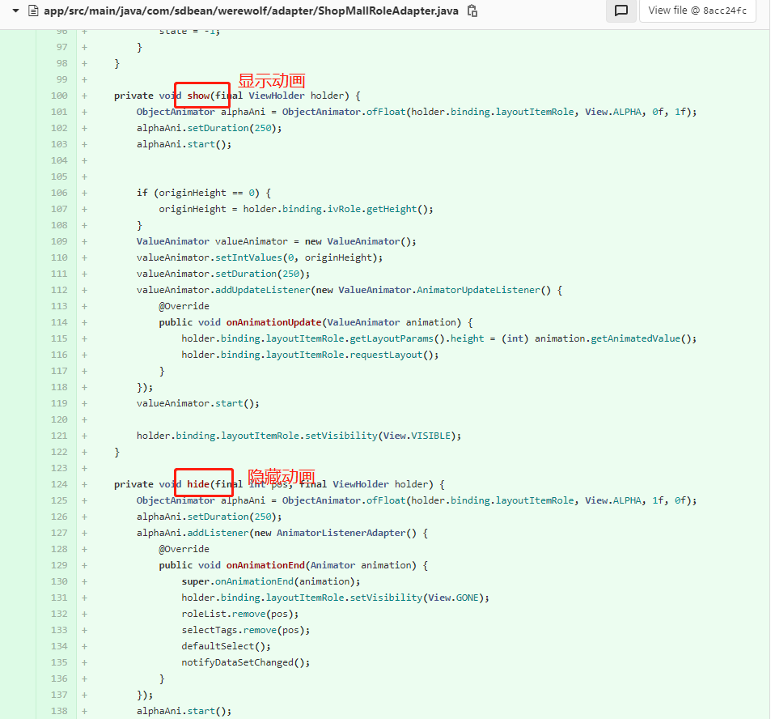

### 商城背包切换

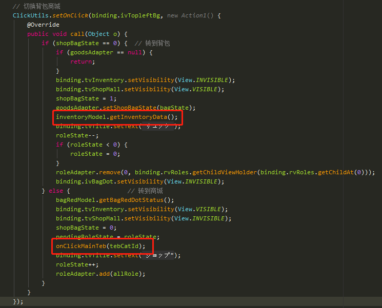

### 开屏广告屏蔽

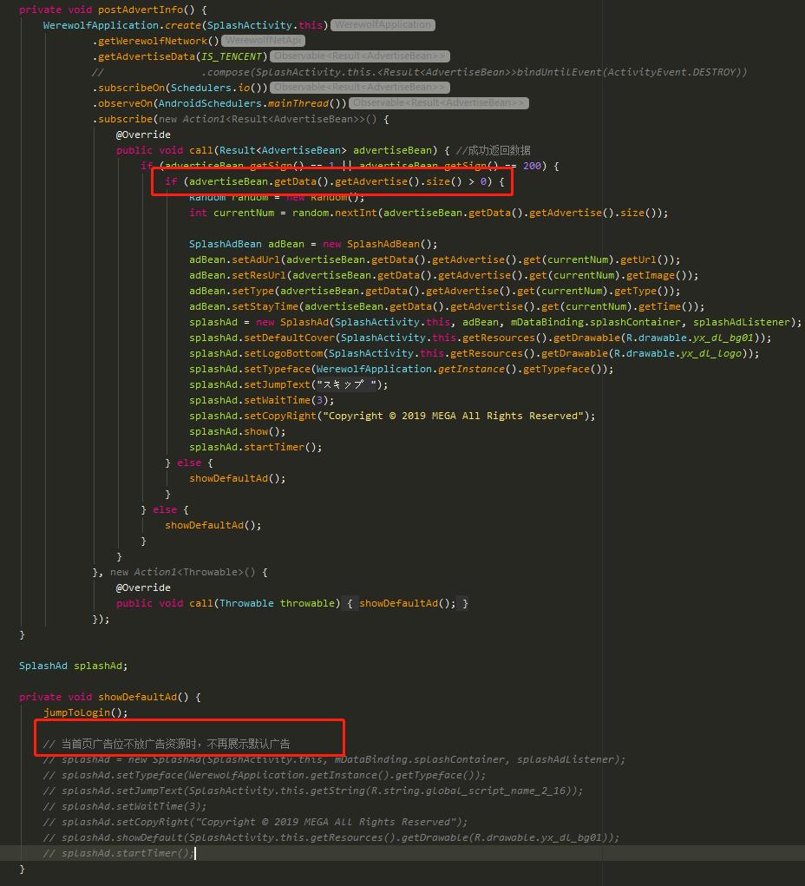

## 8.6～8.7

### 上架物品清单热销状态

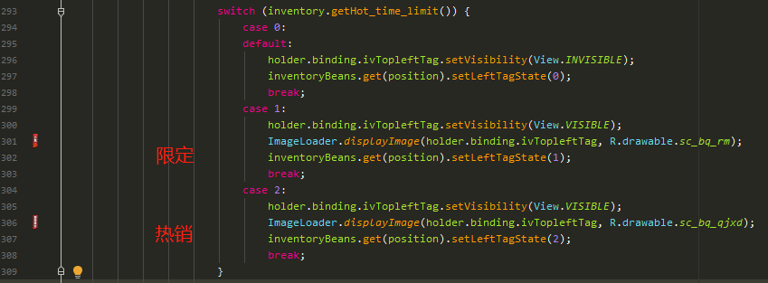

### 本地化文案优化调整，替换最新运营修改返回的文案翻译和图片

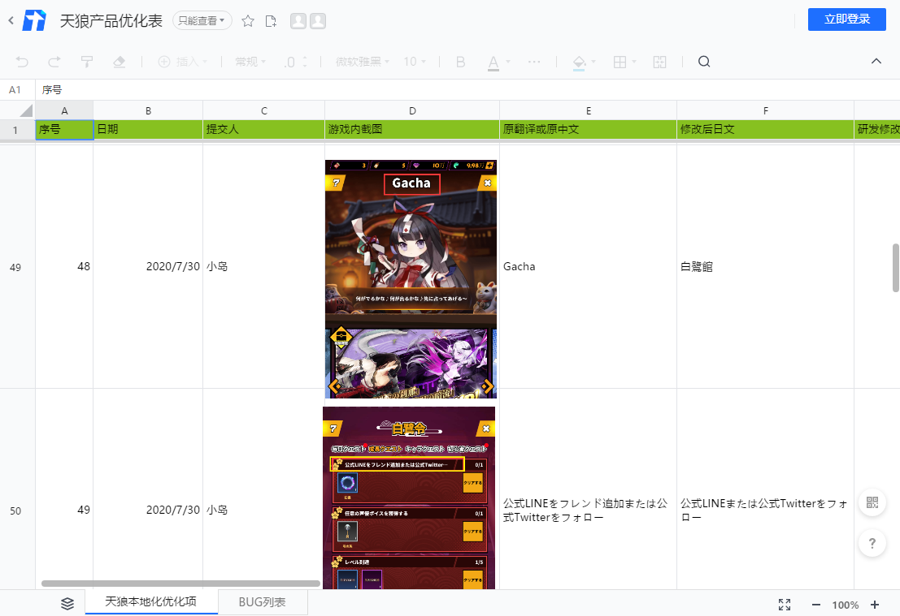

## Bug修复及优化

### 优化Git提交流程

#### gradle脚本

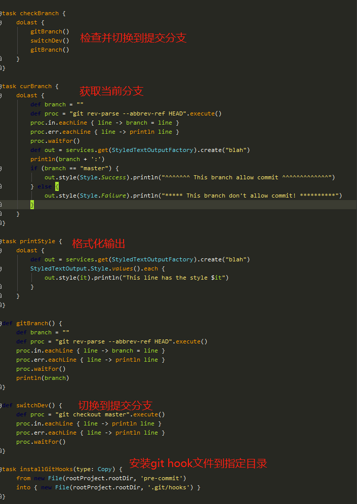

#### githook bash脚本

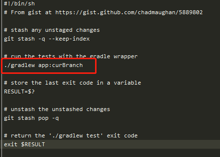

### 重构背包商城代码, 修改一级分类为数据驱动,提高代码兼容性

#### 1.新建一级分类适配器,用列表来管理

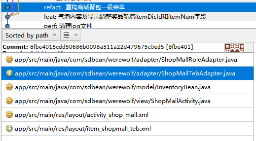

#### 2.整合背包和商城分类的数据结构

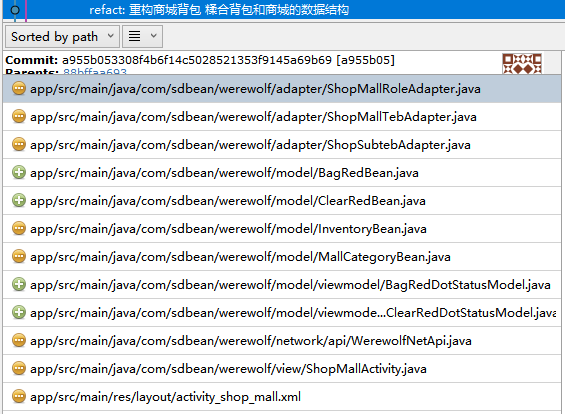

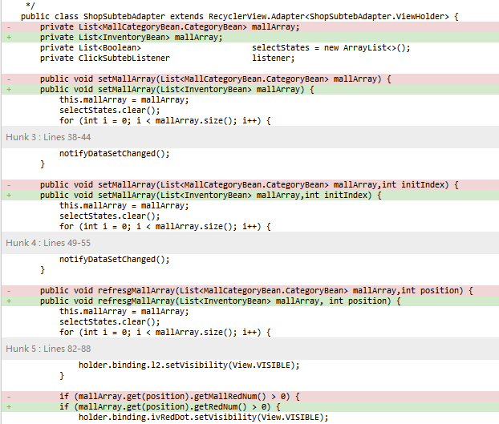

#### 3.删除重构后的无用代码

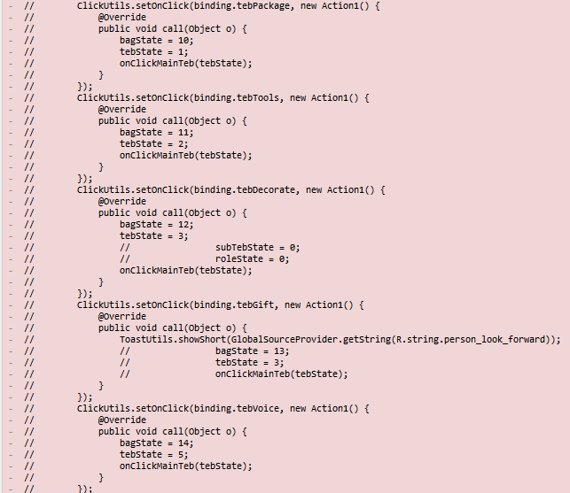